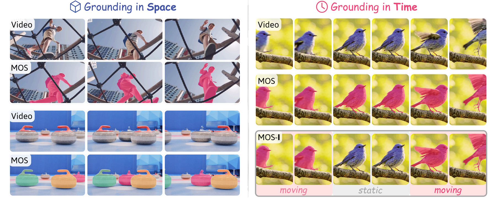

# GMOS: Grounding Moving Object Segmentation in 3D Space and Time

Junyu Xie, Tengda Han, Weidi Xie, Andrew Zisserman

Visual Geometry Group, Department of Engineering Science, University of Oxford

<a src="https://img.shields.io/badge/cs.CV-xxxx.xxxxx-b31b1b?logo=arxiv&logoColor=red" href="https://arxiv.org/abs/xxxx.xxxxx">
</a>
<a href="https://www.robots.ox.ac.uk/~vgg/research/gmos/" alt="Project page">
</a>

&nbsp;

<p align="center">
  
</p>


This repository presents our GMOS method, which operates directly on RGB video and outputs Moving Object Segmentation masks, supporting both the conventional MOS setting and the temporally fine-grained MOS-I setting.

- **GMOS** is a proposer–propagator framework for multi-object MOS.
  - The *proposer* fuses geometric features from a frozen Pi3 encoder with segmentation features from a frozen SAM2 encoder, and predicts per-object masks, motion states, mask IoUs, and confidences.
  - The *propagator* lifts the per-frame proposals into consistent object tracks across the full video using a SAM2 video predictor.
- **GMOS-S** is a foreground–background variant that drops the propagator and outputs one binary mask per frame for faster inference.

&nbsp;

## Installation

```bash
git clone https://github.com/Jyxarthur/gmos.git && cd gmos
pip install torch==2.5.1 torchvision==0.20.1 --index-url https://download.pytorch.org/whl/cu124
pip install -r requirements.txt
```

Tested with Python 3.11 and CUDA 12.4.

&nbsp;

## Checkpoints & precomputed results

| Model | Weights |
|---|---|
| Pi3 (geometric encoder, frozen) | [`model.safetensors`](https://huggingface.co/yyfz233/Pi3/blob/main/model.safetensors) |
| SAM2 Hiera-L (segmentation encoder, frozen) | [`sam2.1_hiera_large.pt`](https://dl.fbaipublicfiles.com/segment_anything_2/092824/sam2.1_hiera_large.pt) |
| GMOS proposer (multi-object) | [Link](https://drive.google.com/file/d/1OUsz6VJBD6r-VrrV-Q1sonb_XwthrbIk/view?usp=sharing) |
| GMOS-S proposer (foreground/background) | [Link](https://drive.google.com/file/d/1SAyc4maUcpZNgpHjkKN9jxyrHkVp2JBq/view?usp=sharing) |

GMOS and GMOS-S precomputed prediction masks on all benchmark datasets are also available: [Link](https://drive.google.com/file/d/1GMKLKg61jQspjW4JNW7MtifWZkK67HGR/view?usp=sharing).

&nbsp;

## Inference

> **Note on input format.** `inference_gmos.py` / `inference_gmos_s.py` accept `--input_rgb` as one or more `.mp4` files, or one or more directories of JPEG/PNG frames.
> Image-directory inputs additionally require `--fps` or `--stride`.

#### GMOS (multi-object MOS)

```bash
python inference_gmos.py \
    --pi3_ckpt <path>  --sam2_ckpt <path>  --gmos_ckpt <path> \
    --input_rgb <mp4_or_dir [more …]> \
    --save_dir <out_dir> \
    --save_mode mask           # mask | mp4 | mask+mp4
```

Output under `--save_dir`:
- `mos-i_{frame,mp4}/<seq>/…` — temporally fine-grained moving object segmentation
- `mos_{frame,mp4}/<seq>/…`   — conventional moving object segmentation

#### GMOS-S (foreground/background)

```bash
python inference_gmos_s.py \
    --pi3_ckpt <path>  --sam2_ckpt <path>  --gmos_s_ckpt <path> \
    --input_rgb <…> \
    --save_dir <out_dir> \
    --save_mode prob           # prob | mask | mp4 | prob+mask | … | prob+mask+mp4
```

Output: `<save_dir>/{prob,frame,mp4}/<seq>/…` — foreground-background motion segmentation

#### Common flags

Both entry points share the following options.

| &nbsp;&nbsp;&nbsp;&nbsp;&nbsp;&nbsp;&nbsp;&nbsp;&nbsp;&nbsp;&nbsp;flag&nbsp;&nbsp;&nbsp;&nbsp;&nbsp;&nbsp;&nbsp;&nbsp;&nbsp;&nbsp;&nbsp; | description |
|:---|:---|
| `--save_mode`     | saving format. For `inference_gmos.py`: `mask` (palette-indexed PNGs) / `mp4` (DAVIS-palette overlay) / `mask+mp4`. For `inference_gmos_s.py`: `prob` (8-bit grayscale sigmoid PNGs) / `mask` / `mp4`, and any `+`-combination. |
| `--fps`           | per-video fps used to derive the input window stride. If unset, read from the mp4 metadata (mp4 inputs only). |
| `--stride`        | overrides the auto-derived stride. Priority: `--stride` > `--fps` > video metadata. |
| `--batch_size`    | inference batch size. Default `8` for both `inference_gmos.py` and `inference_gmos_s.py`. Lower it (e.g. `4`) if you hit OOM on a smaller GPU. |
| `--offload_cpu`   | offload the DINOv2 + SAM2 feature caches to pinned CPU memory. Use this for long videos that OOM otherwise; expect a small slowdown from per-frame H2D transfers. |

&nbsp;

## GMOS-2K dataset

GMOS-2K is a video moving object segmentation dataset with per-object temporal motion labels, built on top of five existing VOS datasets. It contains 2,210 real-world videos (4,648 moving objects; 1,930 train / 280 test).

Download: [Link](https://drive.google.com/file/d/1HIBtuASf_iLuTPQ1C3VdqqvTWczVTN7w/view?usp=sharing).

For more details, please see [`gmos_2k/README.md`](gmos_2k/README.md).

&nbsp;

## Evaluation

#### MOS-I (temporally fine-grained MOS, *"I" for instantaneous*)

MOS-I evaluates segmentation only on frames where each object is *actively moving*, and penalises false-positive predictions on static or background objects. We report three metrics:

- **`J_mov`** — region similarity 𝒥 on moving frames per object.
- **FP count** — average number of false-positive moving predictions per frame.
- **mtIoU** — temporal IoU averaged over thresholds 𝑘 ∈ {0.5, 0.55, …, 0.95}.

```bash
python metrics/benchmark_mos_i.py \
    --dataset davis17-im     # or ytvos19-im
    --res_dir <save_dir>/mos_frame/ \
    --anno_dir <gmos-2k>/annotations/davis/test/ \
    --time_anno_csv gmos_2k/time_annotation.csv
```

Add `--frame_level_match` to also report the frame-level Hungarian match.

#### Conventional MOS / UVOS

- DAVIS16 / DAVIS17 / DAVIS16-M / DAVIS17-M: use the [official DAVIS evaluator](https://github.com/davisvideochallenge/davis2017-evaluation).
- SegTrackv2 / FBMS-59 / MoCA: follow the [motiongrouping](https://github.com/charigyang/motiongrouping) protocol.

&nbsp;

## Citation

```bibtex
@article{xie2026gmos,
    title     = {GMOS: Grounding Moving Object Segmentation in 3D Space and Time},
    author    = {Junyu Xie and Tengda Han and Weidi Xie and Andrew Zisserman},
    journal   = {arXiv preprint arXiv:2605.30352},
    year      = {2026}
}
```

&nbsp;

## References

- Pi3:  [https://github.com/yyfz233/Pi3](https://github.com/yyfz233/Pi3)
- SAM2: [https://github.com/facebookresearch/sam2](https://github.com/facebookresearch/sam2)
